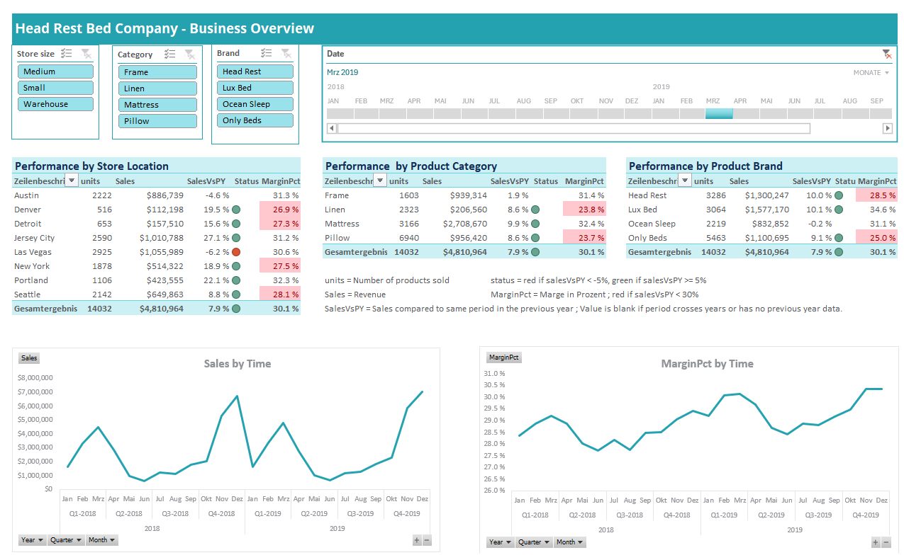

# Dashboard
Erstellung eines interaktiven Dashboards zur Visualisierung der Unternehmensleistung mithilfe von Excel, Power Query und Power Pivot
## Übersicht
Dieses Projekt wurde im Rahmen der Weiterbildung „Data Skills for Excel Professionals Specialization“ des Corporate Finance Institute auf der Plattform Coursera durchgeführt. Ziel des Projekts war die Erstellung eines Dashboards zur Verfolgung der Unternehmensleistung. Als Datengrundlage dienten die Verkaufsdaten des fiktiven Unternehmens Head Rest Bed Company aus den Jahren 2018 und 2019. Die Head Rest Bed Company vertreibt Bettzubehör an acht Standorten in den USA und bietet ihre Produkte in vier Kategorien (Bettrahmen, Matratzen, Bettwäsche und Kopfkissen ) unter vier Marken an.

## Daten 
Die verwendeten Daten stammen aus dem genannten Kurs und bestehen aus insgesamt sechs verknüpften Tabellen. Die zentrale Tabelle „Sales“ enthält 133.978 Verkaufsdatensätze mit neun Merkmalen, darunter: Verkaufsdatum, Standort,Manager,Produkt,Verkaufsmenge,Preis, Marge und Werbeaktion. Die weiteren Tabellen liefern ergänzende Informationen zu diesen Merkmalen,beispielsweise detaillierte Angaben zu Produkten, Standorten und Managern. Auf Basis dieser strukturierten und integrierten Datenbasis wurde ein interaktives Dashboard entwickelt, das eine fundierte Analyse der Unternehmensleistung ermöglicht.

## Ergebnis

## Fazit
Mit diesem Dashboard ist es möglich, die Leistung pro Standort, Produktkategorie und Produktmarke zu analysieren.
Unter „Leistung“ sind Kennzahlen wie die Verkaufsmenge, der Umsatz, der prozentuale Anteil des Umsatzes im ausgewählten Zeitraum im Vergleich zum entsprechenden Zeitraum des Vorjahres sowie die Marge in Prozent zu verstehen. Diese Kennzahlen können nach verschiedenen Dimensionen gefiltert werden, darunter: Zeitraum (Jahr, Quartal, Monat, Woche, Tag), Standort, Produktkategorie (falls erforderlich) und  Produktmarke (falls erforderlich). Mit Ausnahme des Zeitraums lassen sich diese Filter auch auf zwei Zeitreihendiagramme anwenden:die Entwicklung von Umsatz und Marge über die Zeit. 